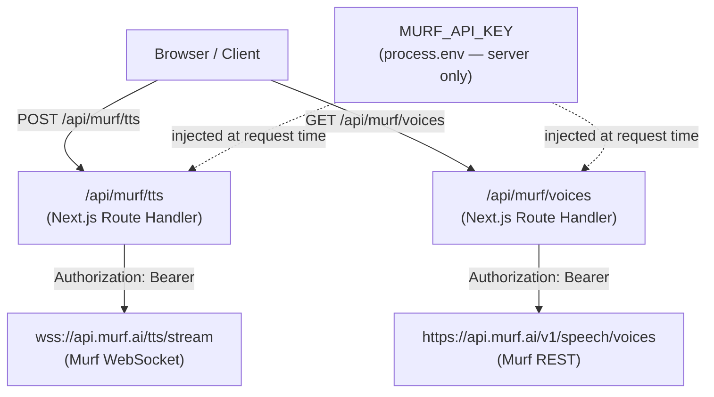
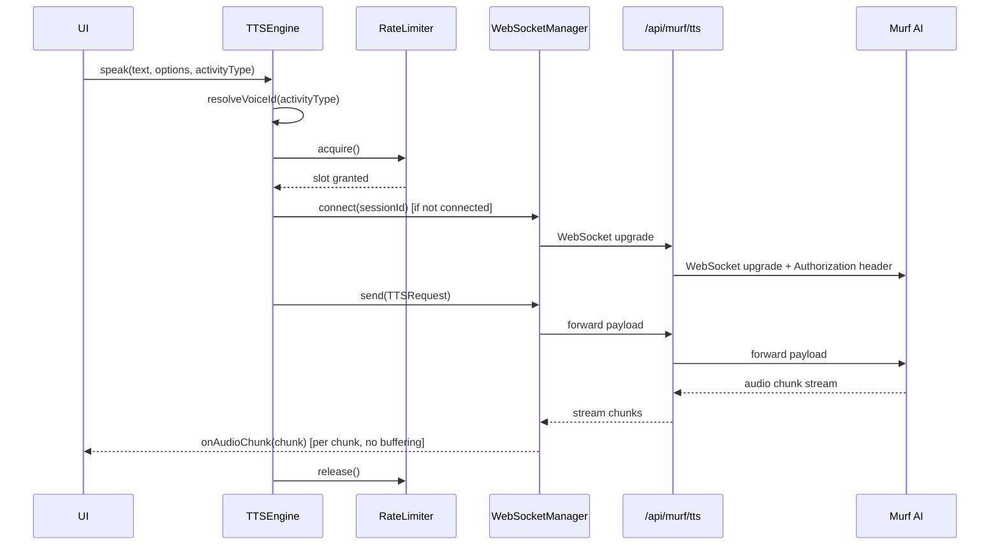

# Design Document: Murf AI Voice Integration

## Overview

This document describes the technical design for wiring WellFlow's existing voice component
scaffolding to the live Murf AI API. The integration covers secure credential management,
real-time TTS streaming over WebSocket, voice catalogue browsing and assignment, multilingual
synthesis (English and Spanish), accessibility text fallback, and rate-limit compliance.

The existing components — `TTSEngine`, `WebSocketManager`, `VoiceSelector`, and `RateLimiter` —
are already scaffolded in `src/components/`. This design specifies how they connect to the real
Murf AI endpoints, how the Next.js API proxy routes protect the API key, and how the system
behaves under error conditions.

---

## Architecture

All Murf AI traffic flows through two Next.js API routes that act as server-side proxies. The
browser never holds the API key; it only talks to `/api/murf/tts` and `/api/murf/voices`.



### Component Interaction



---

## Components and Interfaces

### TTSEngine

Responsible for submitting text to Murf AI and streaming audio back. Sits between the UI and the
lower-level `WebSocketManager` and `RateLimiter`.

**Key responsibilities:**
- Resolve the correct voice ID using the priority chain (explicit → activity → fallback → default)
- Map locale strings to Murf API language codes (`en` → `en-US`, `es` → `es-ES`)
- Acquire a rate-limiter slot before each attempt; release on completion or error
- Retry exactly once on failure; invoke `onTextFallback` if both attempts fail
- Invoke `onUnsupportedLanguage` for locales outside `{en, es}`

**Interface (existing, unchanged):**
```typescript
interface TTSEngineCallbacks {
  onTextFallback: (text: string) => void;
  onUnsupportedLanguage: (language: string) => void;
}

interface VoiceResolverInterface {
  getVoiceForActivity(activityType: ActivityType): string | null;
  getCurrentProfile(): { fallbackVoiceId: string | null };
}

class TTSEngine {
  speak(text: string, options: TTSOptions, activityType?: ActivityType): Promise<void>;
  setSpeed(speed: 'slow' | 'normal' | 'fast'): void;
}
```

### WebSocketManager

Maintains a persistent WebSocket connection per session to the Murf AI streaming endpoint (via
the `/api/murf/tts` proxy). Handles reconnection, inactivity timeout, and audio chunk forwarding.

**Key responsibilities:**
- Open a connection before the first TTS request of a session
- Detect unexpected closures and schedule reconnect within 2 seconds
- Reset a 3-minute inactivity timer on every `send()` call
- Invoke `onMaxRetriesExceeded` after 3 consecutive failed reconnects
- Forward binary audio chunks to `onAudioChunk` without buffering

**Interface (existing, unchanged):**
```typescript
class WebSocketManager {
  onAudioChunk: ((chunk: ArrayBuffer) => void) | null;
  onError: ((error: WebSocketError) => void) | null;
  onClose: ((reason: CloseReason) => void) | null;
  onMaxRetriesExceeded: ((sessionId: string) => void) | null;

  connect(sessionId: string): Promise<void>;
  disconnect(sessionId: string): void;
  send(payload: TTSRequest): void;
  isConnected(sessionId: string): boolean;
}
```

### VoiceSelector

Fetches and caches the Murf AI voice catalogue, exposes filtering and preview, and manages the
per-user `VoiceProfile` (activity assignments + fallback voice).

**Key responsibilities:**
- Fetch the voice catalogue from `/api/murf/voices` on first initialisation; cache in memory
- Filter voices by any combination of `name`, `accent`, `gender`, `style`
- Preview a voice by submitting a sample text through `TTSEngine` with the selected voice ID
- Persist and load `VoiceProfile` via `ProfileStore`

**Interface (existing, with additions):**
```typescript
interface VoiceSelectorCallbacks {
  onPreviewError: (voiceId: string, message: string) => void;
}

class VoiceSelector {
  listVoices(filters?: VoiceFilter): Promise<MurfVoice[]>;
  previewVoice(voiceId: string): Promise<void>;
  assignVoice(activityType: ActivityType, voiceId: string): void;
  setFallbackVoice(voiceId: string): void;
  getVoiceForActivity(activityType: ActivityType): string | null;
  getCurrentProfile(): VoiceProfile;
  loadVoiceProfile(userId: string): Promise<void>;
  saveVoiceProfile(userId: string): Promise<void>;
}
```

**New method — `initialise(language: string)`:**
Fetches the voice catalogue from `/api/murf/voices` and caches it. Idempotent — subsequent calls
are no-ops. Passes the current session language so preview requests use the correct locale.

### RateLimiter

Enforces a maximum of 3 concurrent TTS requests. Queues excess requests and releases slots
immediately on completion or failure. Cancels requests that wait more than 10 seconds.

**Key change from current scaffold:** The current implementation caps at `MAX_CONCURRENT = 2`.
Per Requirement 10.1, this must be updated to `MAX_CONCURRENT = 3`. The 10-second timeout
(Requirement 10.4) must also be added.

**Interface (existing, with timeout addition):**
```typescript
interface RateLimiterInterface {
  acquire(timeoutMs?: number): Promise<void>;  // throws on timeout
  release(): void;
  readonly activeCount: number;
}
```

### Next.js API Route Proxy — `/api/murf/tts`

A Next.js Route Handler (`app/api/murf/tts/route.ts`) that:
1. Validates the `Origin` header matches the application's own origin (same-origin check)
2. Returns HTTP 403 if the check fails — no forwarding
3. Reads `MURF_API_KEY` from `process.env` (server-side only)
4. Upgrades the connection to WebSocket and proxies it to `wss://api.murf.ai/tts/stream`,
   injecting `Authorization: Bearer <key>` on the upstream handshake
5. Streams audio chunks back to the client without buffering

### Next.js API Route Proxy — `/api/murf/voices`

A Next.js Route Handler (`app/api/murf/voices/route.ts`) that:
1. Validates the `Origin` header (same-origin check)
2. Returns HTTP 403 on failure
3. Reads `MURF_API_KEY` from `process.env`
4. Forwards a `GET` request to `https://api.murf.ai/v1/speech/voices` with the auth header
5. Returns the JSON response to the client

### Configuration Validator

A small server-side module (`lib/murf-config.ts`) called at startup (or on first request) that:
- Reads `process.env.MURF_API_KEY`
- Throws a `ConfigurationError` if the value is absent or empty
- Returns the validated key for use by the proxy routes

---

## Data Models

These types already exist in `src/types/index.ts`. They are reproduced here for reference and
to document the JSON serialisation contract.

### VoiceProfile

```typescript
interface VoiceProfile {
  activityAssignments: Partial<Record<ActivityType, string>>; // activityType → voiceId
  fallbackVoiceId: string | null;
}
```

Serialisation contract: all fields are JSON-primitive-compatible. `JSON.stringify` / `JSON.parse`
round-trips are lossless. `activityAssignments` keys are the four `ActivityType` string literals;
values are Murf voice ID strings.

### TTSOptions

```typescript
interface TTSOptions {
  language: string;          // 'en' | 'es' (others trigger onUnsupportedLanguage)
  speed: 'slow' | 'normal' | 'fast';
  sessionId: string;
  voiceId?: string;          // explicit override; omit to use voice resolution
}
```

### MurfVoice

```typescript
interface MurfVoice {
  voiceId: string;
  name: string;
  accent: string;
  gender: 'male' | 'female' | 'neutral';
  style: string;
}
```

### Language Mapping Table

| Locale (`TTSOptions.language`) | Murf API `language` value |
|-------------------------------|--------------------------|
| `en`                          | `en-US`                  |
| `es`                          | `es-ES`                  |
| anything else                 | `en-US` + `onUnsupportedLanguage` callback |

### Voice Resolution Priority

| Priority | Source                                      | Condition                                      |
|----------|---------------------------------------------|------------------------------------------------|
| 1        | `TTSOptions.voiceId`                        | Explicitly provided by caller                  |
| 2        | `VoiceProfile.activityAssignments[activityType]` | `activityType` provided and has an assignment |
| 3        | `VoiceProfile.fallbackVoiceId`              | No activity assignment found                   |
| 4        | `"murf-default"`                            | No fallback set in profile                     |

---

## Correctness Properties

*A property is a characteristic or behavior that should hold true across all valid executions of a
system — essentially, a formal statement about what the system should do. Properties serve as the
bridge between human-readable specifications and machine-verifiable correctness guarantees.*

### Property 1: All outbound Murf API requests carry the Authorization header

*For any* TTS request or voice catalogue request forwarded by the proxy routes, the upstream HTTP
or WebSocket handshake request must include an `Authorization: Bearer <key>` header where `<key>`
is the value of `MURF_API_KEY`.

**Validates: Requirements 2.1, 2.2**

---

### Property 2: Auth errors suppress retries and activate fallback

*For any* TTS request that receives an HTTP 401 or 403 response from Murf API, the system must
invoke `onAuthError`, activate text fallback, and make no further retry attempts for that request.

**Validates: Requirements 2.3, 2.4**

---

### Property 3: Audio chunks are forwarded immediately

*For any* sequence of audio chunks received from Murf API, each chunk must be forwarded to the
`onAudioChunk` callback before the next chunk is processed — no full-response buffering occurs.

**Validates: Requirement 3.2**

---

### Property 4: TTSOptions language and speed are faithfully mapped

*For any* `TTSOptions` with a supported language (`en` or `es`) and any speed value, the outbound
Murf API request must contain the mapped language code (`en-US` or `es-ES`) and the exact speed
value from the options.

**Validates: Requirements 3.3, 3.4, 9.1, 9.2**

---

### Property 5: Double TTS failure triggers text fallback with original text

*For any* text string, if both the initial TTS attempt and the single retry both fail, the
`onTextFallback` callback must be invoked with exactly the original text string (unmodified).

**Validates: Requirement 3.6**

---

### Property 6: Inactivity timer resets on every send

*For any* session, after each call to `WebSocketManager.send()`, the inactivity timer must be
reset to 3 minutes from that moment — regardless of how many sends have occurred previously.

**Validates: Requirement 4.4**

---

### Property 7: Voice filter returns only matching voices

*For any* list of `MurfVoice` objects and any `VoiceFilter`, every voice returned by
`listVoices(filter)` must satisfy all non-undefined filter fields simultaneously.

**Validates: Requirement 5.2**

---

### Property 8: Voice catalogue is fetched at most once per session

*For any* number of calls to `VoiceSelector.initialise()` within a single application session,
the underlying HTTP request to `/api/murf/voices` must be made exactly once.

**Validates: Requirement 5.4**

---

### Property 9: Preview failure invokes callback without throwing

*For any* voice ID, if the preview TTS request fails for any reason, `onPreviewError` must be
invoked with that voice ID and a non-empty error message, and no exception must propagate to the
caller.

**Validates: Requirement 6.2**

---

### Property 10: Voice resolution follows priority order

*For any* combination of `TTSOptions.voiceId`, `VoiceProfile.activityAssignments`, and
`VoiceProfile.fallbackVoiceId`, the resolved voice ID must be the highest-priority non-null value
in the chain: explicit override → activity assignment → fallback → `"murf-default"`.

**Validates: Requirements 8.1, 8.2, 8.3**

---

### Property 11: Locale switch propagates to all subsequent TTS requests

*For any* session where the locale is changed mid-session, every TTS request submitted after the
locale change must use the new locale's mapped language code, and no request after the change may
use the old locale's code.

**Validates: Requirement 9.4**

---

### Property 12: Rate limiter never exceeds maximum concurrency

*For any* sequence of `acquire()` and `release()` calls, the `activeCount` must never exceed 3
at any point in time, and every acquired slot must eventually be released (no slot leak).

**Validates: Requirements 10.1, 10.2**

---

### Property 13: Same-origin check gates all proxy forwarding

*For any* request to `/api/murf/tts` or `/api/murf/voices` where the `Origin` header does not
match the application's own origin, the route must return HTTP 403 and must not make any outbound
request to Murf API.

**Validates: Requirements 12.3, 12.4**

---

### Property 14: VoiceProfile JSON round-trip is lossless

*For any* `VoiceProfile` value (including all combinations of activity assignments and fallback
voice IDs), serialising to JSON and deserialising back must produce a value that is deeply equal
to the original.

**Validates: Requirements 7.1, 7.2, 7.3, 7.4, 7.5**

---

### Property 15: Log entries contain required fields and never contain the API key

*For any* Murf API error event or text-fallback event, the log entry must contain all required
contextual fields (status code or error code, request type, session ID, timestamp or reason), and
for any log entry produced by the system, the string value of `MURF_API_KEY` must not appear.

**Validates: Requirements 13.1, 13.2, 13.3, 13.4**

---

## Error Handling

### Authentication Errors (401 / 403)

- Proxy routes detect 401/403 from Murf API and return the same status to the client
- `TTSEngine` treats a 401/403 response as a non-retryable failure
- `onAuthError` callback is invoked; `onTextFallback` is then invoked with the original text
- No retry is attempted (retrying with the same key will not succeed)

### TTS Request Failures (non-auth)

- `TTSEngine` retries exactly once on any non-auth error
- If the retry also fails, `onTextFallback(text)` is called
- The fallback event is logged with session ID and reason

### WebSocket Disconnection

- `WebSocketManager` detects unexpected closure and schedules a reconnect after 2 seconds
- Up to 3 consecutive reconnect attempts are made
- After 3 failures, `onMaxRetriesExceeded(sessionId)` is invoked
- Each reconnect attempt and failure is logged with error code, reason, and session ID

### Rate Limit Timeout

- If a request waits more than 10 seconds for a `RateLimiter` slot, `acquire()` rejects
- `TTSEngine` catches the rejection and calls `onTextFallback`
- The timeout event is logged with session ID and reason `RATE_LIMIT_TIMEOUT`

### Voice Catalogue Fetch Failure

- `VoiceSelector.initialise()` catches fetch errors and stores an empty voice list
- `onPreviewError` is invoked with a descriptive message
- Subsequent `listVoices()` calls return an empty array until the next session

### Unsupported Locale

- `TTSEngine` detects any locale outside `{en, es}` before sending to Murf API
- `onUnsupportedLanguage(locale)` is invoked
- The request proceeds with `en-US` as the language

### Configuration Error

- `lib/murf-config.ts` throws `ConfigurationError` if `MURF_API_KEY` is absent or empty
- This is caught at application startup (or on first proxy request) and surfaces as a 500 with
  a generic message — the key value is never included in the error message or logs

---

## Testing Strategy

### Dual Testing Approach

Both unit tests and property-based tests are required. They are complementary:

- **Unit tests** verify specific examples, integration points, and error conditions
- **Property tests** verify universal invariants across randomly generated inputs

### Property-Based Testing

The project already uses **fast-check** (`"fast-check": "^3.19.0"` in `package.json`).
Each correctness property from this document must be implemented as a single `fc.assert` test
with a minimum of **100 iterations**.

Each property test must include a comment referencing the design property:

```typescript
// Feature: murf-ai-voice-integration, Property 10: Voice resolution follows priority order
```

**Property test file:** `src/components/MurfVoiceIntegration.property.test.ts`

Property tests to implement (one `fc.assert` per property):

| Test | Property | fast-check Arbitraries |
|------|----------|------------------------|
| P1 — Auth header on all requests | Property 1 | `fc.record({ text: fc.string(), ... })` |
| P2 — Auth error suppresses retry | Property 2 | `fc.constantFrom(401, 403)` |
| P3 — Chunks forwarded immediately | Property 3 | `fc.array(fc.uint8Array())` |
| P4 — Language/speed mapping | Property 4 | `fc.constantFrom('en', 'es')`, `fc.constantFrom('slow', 'normal', 'fast')` |
| P5 — Double failure → fallback | Property 5 | `fc.string({ minLength: 1 })` |
| P6 — Inactivity timer resets | Property 6 | `fc.array(fc.string(), { minLength: 1 })` |
| P7 — Filter returns matching voices | Property 7 | `fc.array(fc.record({ voiceId: fc.string(), name: fc.string(), accent: fc.string(), gender: fc.constantFrom('male','female','neutral'), style: fc.string() }))` |
| P8 — Catalogue fetched once | Property 8 | `fc.integer({ min: 1, max: 20 })` (call count) |
| P9 — Preview error no throw | Property 9 | `fc.string({ minLength: 1 })` (voice ID) |
| P10 — Voice priority chain | Property 10 | `fc.record({ voiceId: fc.option(fc.string()), activityAssignment: fc.option(fc.string()), fallback: fc.option(fc.string()) })` |
| P11 — Locale switch propagates | Property 11 | `fc.constantFrom('en', 'es')`, `fc.constantFrom('en', 'es')` (before/after) |
| P12 — Rate limiter concurrency | Property 12 | `fc.integer({ min: 1, max: 20 })` (request count) |
| P13 — Same-origin gate | Property 13 | `fc.string()` (origin header values) |
| P14 — VoiceProfile round-trip | Property 14 | `fc.record({ activityAssignments: fc.dictionary(...), fallbackVoiceId: fc.option(fc.string()) })` |
| P15 — Logs contain fields, no key | Property 15 | `fc.record({ statusCode: fc.integer(), sessionId: fc.string() })` |

### Unit Tests

**Unit test file:** `src/components/MurfVoiceIntegration.test.ts`

Focus areas:
- `ConfigurationError` thrown when `MURF_API_KEY` is absent or empty (Req 1.2)
- `.env.example` file exists and contains `MURF_API_KEY=` without a real value (Req 1.4)
- Exactly one retry on first TTS failure, then fallback (Req 3.5, 3.6)
- `WebSocketManager` reconnects after unexpected close (Req 4.3)
- `WebSocketManager` invokes `onMaxRetriesExceeded` after 3 failures (Req 4.6)
- `WebSocketManager` closes with `INACTIVITY_TIMEOUT` after 3 minutes of silence (Req 4.5)
- `VoiceSelector.initialise()` populates voice list on success, empty list on failure (Req 5.1, 5.3)
- `VoiceSelector.previewVoice()` uses current session language (Req 6.3)
- Rate limiter cancels request after 10-second wait (Req 10.4)
- Text fallback displayed within 200ms of `onTextFallback` invocation (Req 11.1)
- `/api/murf/tts` returns 403 for cross-origin requests (Req 12.4)
- `/api/murf/voices` returns 403 for cross-origin requests (Req 12.4)

### Test Configuration

```javascript
// jest.config.js additions (if needed)
// Tests already run via: jest --runInBand
// Property tests: minimum 100 runs via fc.assert(fc.property(...), { numRuns: 100 })
```
